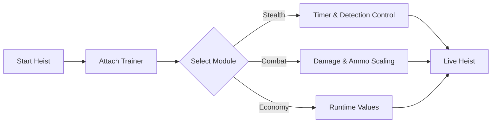

# PAYDAY 2 Trainer

There’s a hush before the drill bites metal. A breath held while the pager rings. **PAYDAY 2** lives in that tension—where control matters more than chaos, and knowledge weighs more than firepower.

The **PAYDAY 2 Trainer** is a precise PC control tool for players who want to *understand* the heist from the inside out. Not to cheapen the thrill, but to dissect it—to slow the pulse, adjust the pressure, and learn how every system clicks together behind the mask.

---

## 🧠 Overview

Crafted for **PAYDAY 2**, the trainer works live during gameplay, offering reversible toggles and smooth sliders. No save carving. No permanent fingerprints. Turn it on, observe the machine, turn it off—clean as a ghost exit.

Design philosophy:

* Control without spectacle
* Learning over shortcuts
* Respect for pacing and flow

Whether you’re practicing stealth routes, stress-testing loud builds, or filming cinematic runs, the trainer stays quiet until summoned.

---

## 🎛 Core Trainer Features

### 🛡 Survival & Endurance

* God Mode toggle (testing scenarios)
* Adjustable health & armor values
* Downed-state control
* Fall and environmental damage tuning

### 🔫 Combat Calibration

* Damage multipliers (player ↔ enemies)
* Infinite ammo & no reload (optional)
* Recoil and spread softening
* Fire-rate and reload speed control

> [!NOTE]
> Gentle settings feel like experience. Extreme values are best reserved for testing and experimentation.

---

## 🥷 Stealth & Heist Flow

Silence has its own mechanics—and they’re worth studying.

* Guard and civilian awareness indicators
* Pager interaction control
* Drill and lockpick timer adjustment
* Detection meter freeze (sandbox use)

These tools let you explore stealth logic without restarting a heist ten times in a row.

---

## 💰 Economy & Progression Sandbox

For learning systems, not erasing them.

* Experience gain multiplier
* Money lock (session-based)
* Skill point sandbox (runtime-only)
* Carry weight adjustments

> [!IMPORTANT]
> Progression changes live in memory only. Disable them before saving if you want untouched career progression.

---

## ⚙ Setup & First Job

Quiet steps. Clean setup.

1. Launch **PAYDAY 2**
2. Run the Trainer as administrator
3. Wait for attachment confirmation
4. Open the menu via hotkey
5. Adjust values live—no restart

Example bindings:

```text
INSERT – Open / Close Menu
F1     – God Mode
F2     – Infinite Ammo
F3     – Damage +
F4     – Damage -
F5     – Stealth Tools
```

> [!WARNING]
> Intended for learning, testing, and controlled environments. Always respect game rules and teammates.

---

## 🔄 Runtime Logic (Conceptual)



Close the trainer, and the city forgets you were ever there.

---

## ❓ FAQ

**How is this different from a mod menu?**
A trainer focuses on gameplay values and systems rather than visual overlays.

**Can I fine-tune instead of toggling extremes?**
Yes—most features rely on sliders, not on/off switches.

**Does it affect FPS?**
Designed to be lightweight with minimal performance impact.

**Is it useful for learning stealth?**
Many players use it to study guard paths, pager limits, and timing windows.

**Will updates break it?**
Minor patches usually pass unnoticed; major updates may require a refresh.

---

## 🌒 Final Thoughts

A perfect heist isn’t loud—it’s deliberate. The **PAYDAY 2 Trainer** doesn’t steal the adrenaline; it sharpens your understanding of it. When you see the gears turning, every decision lands cleaner.

Masks on.
Voices low.
And when the vault opens—

Leave nothing behind but silence.
